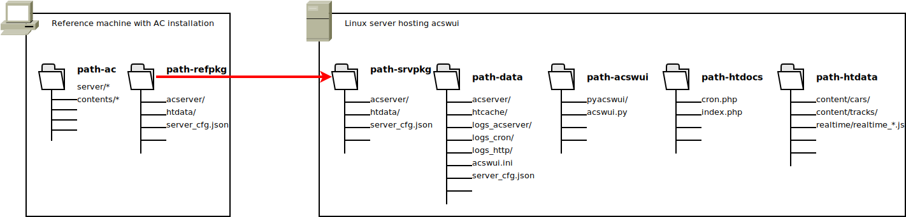

# Introduction

Assetto Corsa Server Web User Interface

# Directories

For the acswui instllation two machines are of interest:

* A win machine with the reference installation of AC
* A linux machine which runs the server

## path-ac

This is the AC installation directory.
It must be an installation including all mods which shall be available on the server later.

## path-refpkg

This directory is filled with the "acswui.py package" command.
It gathers all data from teh AC reference installation together which is needed for acswui.

Before creating a new package, this directory must be emptied.

## path-srvpkg

This directory contains the exact copy of path-refpkg.
The idea is, that path-refpkg is created on a local win machine and then transferred to a remote linux machine.

## path-data

This directory contains the acServer binaries, as well as additional cache and log files.
This direcrory mus be presrverd across acswui instllation updates.

## path-htdocs

This directory contains the website documents accessed primarily from HTTP requests (eg index.php).
It is safe to clean this directory across acswui installation updates.

## path-htdata

This directory contains secondary files accessed via HTTP.
For example: car skin images or track images.

It is recommended to not delete this direcrory anytime.
So, images from obsolete cars or tracks are still available.

# Installation Guide

The installation consists of two steps:

* Creating a package from the reference installation and transfer it to the linux server
* Run the installation on the linux server

## Referecne Machine

1. clone acswui && cd acswui
1. cp acswui.ini myserver.ini
1. ./acswui.py -vv package myserver.ini
1. copy path-refpkg to path-srvpkg (on the remote server)

## Linux Server

1. clone acswui && cd acswui
1. cp acswui.ini myserver.ini
1. enure to have all directories created
1. ./acswui.py -vv install --base-data --root-password MYROOTPASSWORD myserver.ini
1. create cronjob:
    1. crontab- e
    1. */1 * * * * cd /var/acswui_htdocs && nice -19 php7.4 cron.php

# Update Guide

On AC reference instllation machine

1. cd acswui/
1. git pull
1. ./acswui.py -vv package myserver.ini
1. cp path-refpkg path_srvpkg

On linux server machine

1. cd acswui/
1. git pull
1. ./acswui.py -vv install --root-password MYROOTPASSWORD myserver.ini
